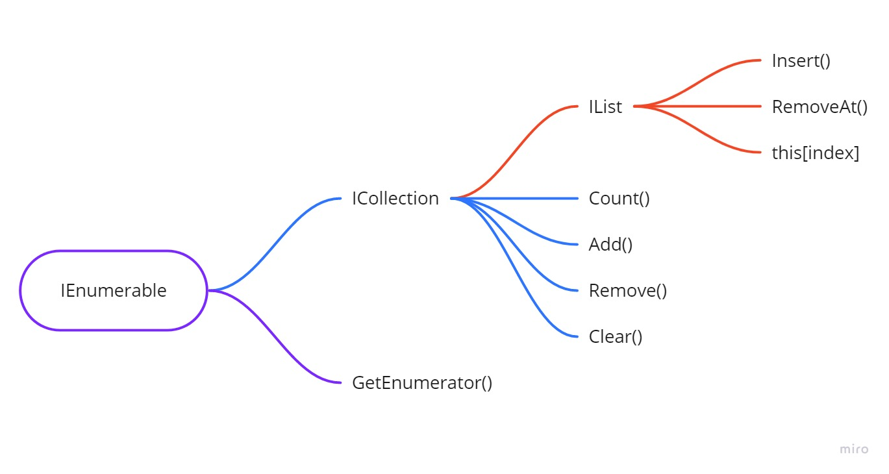

# Anonymous functions and LINQ 🍣

## Anonymous functions 🔹

### Lambda expression

Lambda expression is a short and easy way of writing anonymous functions. These lambda expressions are available in C#, but in other languages as well. They are usually used in higher-order methods and are very widely used. The idea of a lambda expression is to have a shorthand way of writing a method, most of the time in one line. Lambda methods can be written in multiple lines as well, but the code needs to be wrapped in { } brackets.

```csharp
List<string> names = new List<string>()
{
    "Bob", "Jill", "Wayne", "Greg", "John", "Anne"
};
List<string> empty = new List<string>();
```

```csharp
// Lambda expression in a Find method
string foundBob = names.Find(x => x == "Bob");
```

### Func with lambda expression

There are entities in C# that basically encapsulate and point to a signature of a method. These definitions for methods are called delegates and Func is one such definition. We can add an anonymous method in this definition easily and use it. The main rule of Func is that the method MUST have a return value and that the type of the return value as well as the parameters that we need, must be decided beforehand.

#### No parameters Func

```csharp
Func<bool> isNamesEmpty = () => names.Count == 0;
Console.WriteLine($"IsNamesEmpty: {isNamesEmpty()}");
```

#### Two parameters Func

```csharp
Func<int, int, int> sum = (x, y) => x + y;
Console.WriteLine($"sum: {sum(2, 3)}");
```

### Action with lambda expression

Action method definition is very similar to Func. They are used and written very similarly. The only difference is the return type. Unlike Func which always returns a value, Action never returns anything, making Action void. So for all methods that we need to be void, we use Action. For all of the methods that we need to return something, we use Func.

#### No parameters Action

```csharp
Action hello = () => Console.WriteLine($"Hello there!");
hello();
```

#### Two parameters Action

```csharp
Action<string, ConsoleColor> printColor = (x, y) =>
{
    Console.ForegroundColor = y;
    Console.WriteLine(x);
    Console.ResetColor();
};
printColor("Error!", ConsoleColor.Red);
```

## Using Func and Action in LINQ

We already covered the basics of LINQ. Basically, there are 2 ways of writing LINQ methods. By using SQL-like syntax and with Lambda expression. But there is another way that we can use LINQ. We can save method templates in Func and then pass them to LINQ chains easily instead of writing the same lambda expression multiple times.

### Standard LINQ query

```csharp
string foundBob = names.FirstOrDefault(x => x == "Bob");
Console.WriteLine(foundBob);
```

### Func LINQ query

```csharp
Func<string, bool> IsBob = x => x == "Bob";
string foundJill = names.FirstOrDefault(IsBob);
Console.WriteLine(foundJill);
```

## LINQ 🔹

As we know LINQ ( Language Integrated Query ) is a dynamic and advanced syntax for retrieving information. With a combination of the right LINQ methods, we can create complex queries ( specific requests ) that retrieve basically any combination of business logic that we would ever need. We create these combinations by chaining LINQ methods. Most of the methods return specific values on which we need to chain the other methods. We can't just chain any method, so that is why we must always be aware of the return value of the previous method before we write a new one. Methods that return a collection, always return it as an IEnumerable type, which is the base interface from which all generic collections inherit. Since it is the base, we can convert the result from LINQ methods that return multiple items into whatever we need it to be. Usually, we call the .ToList() method to convert the IEnumerable into List. Some methods return a single item or a single type that is not the same as the original type of our collection, so we have to treat it as such. Writing queries can also be done in two ways: SQL-like syntax and Lambda expressions. In the first examples, there will be code for both of them, but since lambda expressions are more widely used, we will continue working with that for the rest of the examples.


### Setup

```csharp
public class Student
{
    public string FirstName { get; set; }
    public string LastName { get; set; }
    public int Age { get; set; }
    public bool IsPartTime { get; set; }
    public List<Subject> Subjects { get; set; }
    public Student()
    {

    }
    public Student(int id, string first, string last, int age, bool partTime)
    {
        Id = id;
        FirstName = first;
        LastName = last;
        Age = age;
        IsPartTime = partTime;
    }
}

public class Subject
{
    public string Title { get; set; }
    public int Modules { get; set; }
    public int StudentsAttending { get; set; }
    public Academy Type { get; set; }

    public Subject(int id, string title, int modules, int students, Academy type)
    {
        Id = id;
        Title = title;
        Modules = modules;
        StudentsAttending = students;
        Type = type;
    }
}

public enum Academy
{
    Programming,
    Design,
    Networks
}

public static class SEDC
{
    public static List<Student> Students = new List<Student>()
    {
        new Student(12, "Bob", "Bobsky", 29, false),
        new Student(22, "Jill", "Wayne", 36, true),
        new Student(27, "Greg", "Gregsky", 45, false),
        new Student(29, "Anne", "Willson", 31, true),
        new Student(30, "Liana", "Wurtz", 25, false),
        new Student(41, "Bill", "Zu", 38, false)
    };
    public static List<Subject> Subjects = new List<Subject>()
    {
        new Subject(15, "C# Basic", 10, 24, Academy.Programming ),
        new Subject(16,"C# Advanced", 15, 26, Academy.Programming ),
        new Subject(44, "JavaScript", 25, 22, Academy.Programming ),
        new Subject(67, "Photoshop", 12, 18, Academy.Design ),
        new Subject(88, "Illustrator", 12, 18, Academy.Design ),
        new Subject(97,"Networks Basic", 8, 12, Academy.Networks ),
        new Subject(98, "Networks Advanced", 16, 10, Academy.Networks )
    };
    static SEDC()
    {
        Students[0].Subjects = new List<Subject>() { Subjects[0], Subjects[2], Subjects[3], Subjects[4] };
        Students[1].Subjects = new List<Subject>() { Subjects[3], Subjects[4], Subjects[5], Subjects[1] };
        Students[2].Subjects = new List<Subject>() { Subjects[5], Subjects[6] };
        Students[3].Subjects = new List<Subject>() { Subjects[3], Subjects[4] };
        Students[4].Subjects = new List<Subject>() { Subjects[1], Subjects[2], Subjects[3], Subjects[5] };
        Students[5].Subjects = new List<Subject>() { Subjects[2] };
    }
}
```

### Where

- Where filters items by an expression that must be true or false
- Where always returns IEnumerable of the same type as the target collection

```csharp
// SQL Like
IEnumerable<Student> findBobsSql = from x in SEDC.Students
                                   where x.FirstName == "Bob"
                                   select x;
// Lambda Expression
IEnumerable<Student> findBobsLambda = SEDC.Students
.Where(x => x.FirstName == "Bob");
```

### Select

- Select creates a collection with a different form of the initial collection by an expression that can be any value
- Select returns IEnumerable with the type of the value in the expression

```csharp
// SQL Like
List<string> firstNamesSql = (from x in SEDC.Students
  select x.FirstName).ToList();
List<string> studentFullNamesSql = (from x in SEDC.Students
  select $"{x.FirstName} {x.LastName}").ToList();
// Lambda Expression
List<string> firstNamesLambda = SEDC.Students
.Select(x => x.FirstName).ToList();
List<string> studentFullNamesLambda = SEDC.Students
.Select(x => $"{x.FirstName} {x.LastName}").ToList();
```

### Complex query

- We can write a LINQ query inside another LINQ query as long as the inner query is part of an expression that follows the rules of the LINQ query in which it is called in
- For example, if we have Where(), in it we can create another LINQ expression as long as the whole thing returns true or false at the end
- Large chains can be closed with brackets so that a new method can be called on the whole result

```csharp
// SQL Like
List<Student> ptProgrSqlQuery = (from x in SEDC.Students
                                 where x.IsPartTime
                                 where (from y in x.Subjects
                                        where y.Type == Academy.Programming
                                        select y).ToList().Count != 0
                                 select x).ToList();
// Lambda Expression
List<Student> ptProgrLambdaQuery = SEDC.Students.Where(x => x.IsPartTime)
.Where(x => x.Subjects
    .Where(y => y.Type == Academy.Programming)
.ToList().Count != 0)
.ToList();
```

### First / FirstOrDefault

- First tries to get the first item from a collection. If it fails it throws an exception
- FirstOrDefault tries to get the first item from a collection. If it fails it returns a default value ( null for objects )
- We can write an expression inside of these methods to create a filter and then on the filtered result, First or FirstOrDefault to be called

```csharp
Student student1 = SEDC.Students.First();
Student student2 = SEDC.Students.FirstOrDefault();
Student student3 = SEDC.Students.First(x => x.Name == "Bob");
Student student4 = SEDC.Students.FirstOrDefault(x => x.Name == "Bob");
```

### Last/ LastOrDefault

- Last tries to get the last item from a collection. If it fails it throws an exception
- LastOrDefault tries to get the last item from a collection. If it fails it returns a default value ( null for objects )
- We can write an expression inside of these methods to create a filter and then on the filtered result, Last or LastOrDefault to is called

```csharp
Student student1 = SEDC.Students.Last();
Student student2 = SEDC.Students.LastOrDefault();
Student student3 = SEDC.Students.Last(x => x.Name == "Bob");
Student student4 = SEDC.Students.LastOrDefault(x => x.Name == "Bob");
```

### Single/ SingleOrDefault

- Single tries to get one item from a collection. If it fails OR if there are multiple items as a result, it throws an exception
- LastOrDefault tries to get one item from a collection. If it fails it returns a default value ( null for objects ) BUT if there are multiple items as a result, it throws an exception
- We can write an expression inside of these methods to create a filter and then on the filtered result, Single or SingleOrDefault to be called

```csharp
Student student1 = SEDC.Students.Single();
Student student2 = SEDC.Students.SingleOrDefault();
Student student3 = SEDC.Students.Single(x => x.Name == "Bob");
Student student4 = SEDC.Students.SingleOrDefault(x => x.Name == "Bob");
```

### SelectMany

- Flattens a Collection of collections ( Takes all items from all collections and adds them in one collection instead of the items being in separate collections )
- Returns IEnumerable of the type from all the collections inside the main collection

```csharp
// The issue with Select when working with Collection properties
// We have a list of lists and that is hard to work with
List<List<Subject>> partTimeSubjectsSelect = SEDC.Students
.Where(x => x.IsPartTime)
.Select(x => x.Subjects).ToList();
// Merging the lists together
List<Subject> partTimeSubjectsMany = SEDC.Students
.Where(x => x.IsPartTime)
.SelectMany(x => x.Subjects).ToList();
```

### Distinct

- Removes all duplicate values from a collection
- Returns IEnumerable of the same type as the original collection

```csharp
List<Subject> distinctSubjects = partTimeSubjectsMany.Distinct().ToList();
```

### Any

- Checks if there is at least one item in a collection that follows an expression
- Returns true or false depending on the result

```csharp
bool isBob = SEDC.Students
.Any(x => x.FirstName == "Bob");
```

### All

- Checks if all items of a collection follow a particular expression
- Returns true or false depending on the result

```csharp
bool areThereShortNames = SEDC.Students
.All(x => x.FirstName.Length >= 3);
```

### Except

- Creates a new collection that is missing some particular items
- It returns IEnumerable of the same type as the original collection

```csharp
List<Student> exceptPartTime = SEDC.Students
.Except(SEDC.Students.Where(x => x.IsPartTime)).ToList();
```

### OrderBy / ThenBy

- Orders a collection by a given value
- Can order by ascending - OrderBy and descending - OrderByDescending
- Can have multiple levels of ordering with the ThenBy and ThenByDescending methods
- Returns IEnumerable of the same type as the original collection

```csharp
List<Student> sortedStudents = SEDC.Students
.OrderBy(x => x.FirstName).ToList();
List<Student> sortedStudentsDesc = SEDC.Students
.OrderByDescending(x => x.FirstName).ToList();
List<Student> sortedStudentsThen = SEDC.Students
.OrderBy(x => x.FirstName).ThenBy(x => x.Age).ThenBy(x => x.Id).ToList();
```

## Extra Materials 📘

- [Microsoft - Lambda Expressions](https://docs.microsoft.com/en-us/dotnet/csharp/programming-guide/statements-expressions-operators/lambda-expressions)
- [Microsoft - LINQ](https://docs.microsoft.com/en-us/dotnet/csharp/programming-guide/concepts/linq/)
- [Action, Func and Predicate](https://www.infoworld.com/article/3057152/how-to-work-with-action-func-and-predicate-delegates-in-csharp.html)
