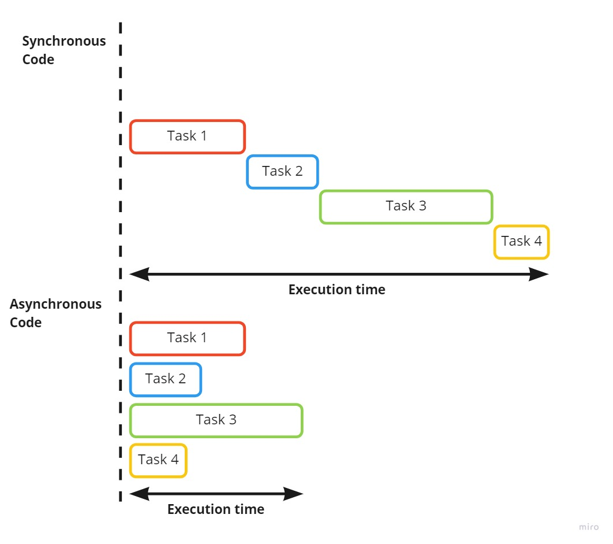
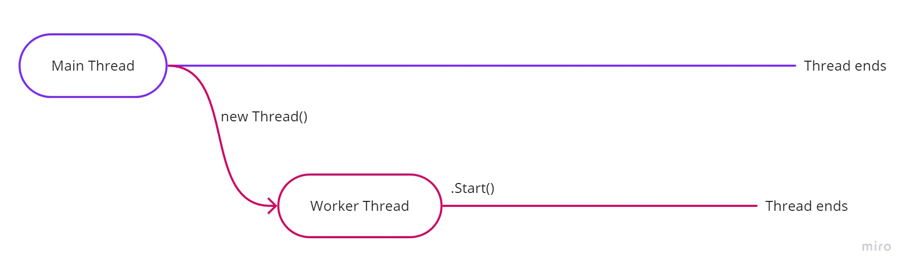
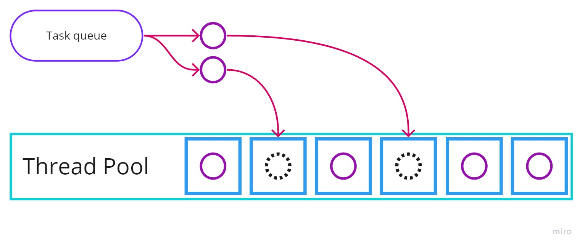

# Asynchronous programming with C# 🍥

## Asynchronous execution🔹

When programming, we expect the code to be executed in the order that we wrote it. We also expect that every line of code needs to wait for the previous one so that it can start executing. This is logical. We declare a variable, then get that variable and use it. We create an if statement and then write code that correlates to that condition. But there are cases where this execution actually hinders our application and can slow down or completely stop the execution flow. This could happen when we are expecting some data from an external source such as a server or file system and that response that we are waiting for is taking a long time. There are also cases where we need to execute something while we are running the code, something that is not dependent on the rest of the code and can be executed by itself at the point when it is done doing some work. In all these scenarios, asynchronous code is the way to go. Asynchronous programming is programming with code that can be executed, finish and give results without waiting for some other code. With it, we create multiple execution tracks that execute code in parallel or just wait until they get some information or response from some other source.  


## Threads🔹

When any code that we run in our console application starts, there is an execution path allocated for that code to run. That execution path is called a thread. This thread is automatically created and it is called the main thread. When code is executed synchronously, the code is executed on this thread only. But when we want to execute code asynchronously this is where it gets interesting. While our main thread is running some code and we decide to run something asynchronously, another thread is created and it starts running the code that needs to be executed asynchronously. We can have multiple of these threads executing some code or waiting for some request at one time. When a thread is over with its code, it gets disposed of. This is one way of working with asynchronous code.

> Note: These threads are not always directly mapped to the threads of the processor



### Synchronous messages

```csharp
public static void SendMessages()
{
    Console.WriteLine("Getting Ready...");
    Thread.Sleep(2000);
    Console.WriteLine("First message arrived!");
    Thread.Sleep(2000);
    Console.WriteLine("Second message arrived!");
    Thread.Sleep(2000);
    Console.WriteLine("Third message arrived!");
    Console.WriteLine("All messages are received!");
    Console.ReadLine();
}
```

### Asynchronous messages

```csharp
public static void SendMessagesWithThreads()
{
    Console.WriteLine("Getting Ready...");
    Thread myThread = new Thread(() => {
        Thread.Sleep(2000);
        Console.WriteLine("First message arrived!");
    });
    myThread.Start();
    new Thread(() =>
    {
        Thread.Sleep(2000);
        Console.WriteLine("Second message arrived!");
    }).Start();
    new Thread(() =>
    {
        Thread.Sleep(2000);
        Console.WriteLine("Third message arrived!");
    }).Start();
    Console.WriteLine("All messages are received!");
    Console.ReadLine();
}
```

## Tasks🔹

The .NET framework provides another more easy-to-use solution to asynchronous programming in C#. Those are the Tasks. Tasks are a representation of some work that needs to be done. Unlike the threads in C#, Tasks are not opening a new execution path every time. There get queued to be executed asynchronously by an available thread. This is done by a system called the Thread Pool which is just a collection of threads that can manage tasks and execute them in a very efficient and organized way. This means that when we want to execute some work asynchronously we create a task, which is queued for execution, the thread pool decides on which thread the task will get executed and the task gets executed. Every phase of the task is kept in a status, so we can track whether the task completed its execution or if it is still in progress or even removed or did not complete the execution successfully.


### Running a single task

```csharp
Task myTask = new Task(() =>
{
    Thread.Sleep(2000);
    Console.WriteLine("Running after 2000ms");
});

myTask.Start();
```

#### Running a single task with a return type

```csharp
Task<int> valueTask = new Task<int>(() =>
{
    Thread.Sleep(2000);
    Console.WriteLine("We can now get the number...");
    return 6;
});

valueTask.Start();
Console.WriteLine(valueTask.Result);
```

## Async/Await🔹

We can always write Tasks manually and use them to make some code asynchronous. But there is another even more clean and organized way of writing asynchronous code. It's with Async/Await. Async is used for making methods asynchronous. These methods can then be executed as asynchronous code. Async methods go hand in hand with Tasks. So every async method must return a task to work. This task can be just a task or a task with a value that we can wait and then use. To wait at some point for an async method to finish or return some value we use await. Await can only be used in an async method as well.

### Example of a method that does work and an ad method that shows in the meantime

```csharp
public static async Task SendMessageAsync(string message)
{
    Console.WriteLine("Sending message...");
    await Task.Run(() => // for making sync with async add await here
    {
        Thread.Sleep(7000);
        Console.WriteLine($"The message {message} was sent!");
    });
}

public static void ShowAd(string product)
{
    Console.WriteLine("While you wait let us show you an ad:");
    Console.Write("Buy the best product in the world ");
    Console.ForegroundColor = ConsoleColor.DarkCyan;
    Console.Write(product);
    Console.ResetColor();
    Console.Write(" now and get ");
    Console.ForegroundColor = ConsoleColor.Green;
    Console.Write("FREE");
    Console.ResetColor();
    Console.WriteLine(" shipping worldwide!");
    Console.ReadLine();
}

var task = SendMessageAsync("Hey there SEDC students!");
ShowAd("Potato");
Console.WriteLine(task.Status); // Check what the status of the task that returned
```

## Extra Materials 📘

* [Advanced working with threads](https://www.infoworld.com/article/3035134/how-to-work-with-threads-in-c.html)
* [Microsoft - Task based asynchronous programming](https://docs.microsoft.com/en-us/dotnet/standard/parallel-programming/task-based-asynchronous-programming)
* [A great article for async/await in C#](https://medium.com/@kayamuhammet/understanding-async-await-in-c-aef956d72e5a)
