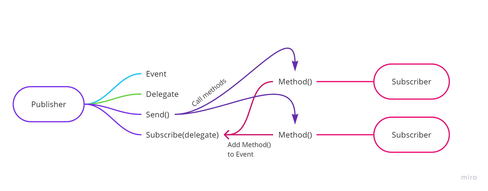

# Delegates and Events 🥧

## Delegates 🔹

Values in C# always have a certain type. Just as values can be represented by a type, so can methods. Delegates are types that represent references to methods. If the method and the delegate share the same signature ( Return and parameter types ) then the delegate can be instantiated with a method that meets the requirements. This means that we can use Delegates as types for methods in a code block, but also as a parameter to a method, creating a higher-order method. In a delegate, a method can be passed as an argument and the result stored as well as a lambda expression. These methods can then be passed to any other place of the type of the delegate, even if they have a different implementation.

### Delegates in Action

```csharp
// Declaring a delegate
public delegate void SayDelegate(string something);

public static void SayHello(string person)
{
    Console.WriteLine($"Hello {person}!");
}
public static void SayBye(string person)
{
    Console.WriteLine($"Bye {person}!");
}

SayDelegate del = new SayDelegate(SayHello); // The SayDelegate points to SayHello
SayDelegate bye = new SayDelegate(SayBye); // The SayDelegate points to SayBye
SayDelegate wow = new SayDelegate(x => Console.WriteLine($"Wow {x}!")); // The SayDelegate points to an anonymous method

// Using the delegate ( Points to methods )
del("Bob");
bye("Jill");
wow("Greg");
```

#### Delegates as parameters

```csharp
public delegate int NumbersDelegate(int num1, int num2);

public static void SayWhatever(string whatever, SayDelegate sayDel)
{
  Console.Write("Chatbot says:");
  sayDel(whatever);
}
SayWhatever("Bob", SayHello);
SayWhatever("Jill", SayBye);
SayWhatever("Greg", x => Console.WriteLine($"Wow {x}!"));
SayWhatever("Anne", x =>
{
    Console.WriteLine($"Stuff with {x}");
    Console.WriteLine($"Other stuff with {x}");

public static void NumberMaster(int num1, int num2, NumbersDelegate numberDel)
{
    Console.WriteLine($"The result is: {numberDel(num1, num2)}");
}

NumberMaster(2, 5, (x, y) => x + y);
NumberMaster(2, 5, (x, y) => x - y);
NumberMaster(2, 5, (x, y) => 0);
NumberMaster(2, 5, (x, y) =>
{
    if (x > y) return x;
    return y;
});
});
```

## Events 🔹

Events are entities that we can use to notify multiple classes or objects when something happens. When the thing happens when we can even send data. Events request a delegate as a type, so that methods that want to follow that action which the event would raise, can just subscribe to that event and get it at the moment the execution. Events are widely used for communication between systems as well as building windows forms.

## Publisher/Subscriber model 🔹

The publisher-subscriber model is a great way to send information to all that want to listen to get particular information when something happens. This system works by creating a Publisher and Subscriber class. The Publisher class needs to take care of the event/events that will accumulate a method that needs to be called when something happens. This publisher class should also have delegates that can be used for the events, and some methods for basic functionality, that implement and call the subscribe method. Subscribers can at any time add a method that matches the event delegate or remove one so that when the Publisher sends their info, just the people that subscribed and left their method in the event will get the message.


### Publisher

```csharp
public class Publisher
{
  public delegate void DataProcessingDelegate(string message);
  public event DataProcessingDelegate DataProcessingHandler;
  public void ProcessData(string message) // business logic
  {
    Console.WriteLine("Processing data...");
    Thread.Sleep(3000); // zavrsuva rabota! mnogu e tesko! 3 sekundi!
    WhenDataIsProcessed(message);
  }
  // It notifies all subscribers of the message that is processed from the ProcessData method
  protected void WhenDataIsProcessed(string message)
  {
    if (DataProcessingHandler != null)
    {
      DataProcessingHandler(message);
    }
  }
}
```

### Subscribers

```csharp
public class Subscriber1
{
    public void GetMessage(string message)
    {
        Console.WriteLine("Subscriber 1 here!");
        Console.WriteLine("YAY I GOT MY MESSAGE!");
        Console.WriteLine($"THE MESSAGE IS: {message}");
    }
    public string GetMessageFAIL(int num)
    {
        return "This will FAIL!";
    }
}

public class Subscriber2
{
    public void GetMessage(string message)
    {
        Thread.Sleep(2000);
        Console.WriteLine("Subscriber 2 here!");
        Console.WriteLine("I AM NOT IMPRESSED WITH THE MESSAGE!");
        Console.WriteLine($"THE MESSAGE IS: {message}");
    }
}
```

### Using the model

```csharp
string fancyMessage = "This is a very fancy message!";
Publisher publisher = new Publisher();
Subscriber1 sub1 = new Subscriber1();
Subscriber2 sub2 = new Subscriber2();

publisher.DataProcessingHandler += sub1.GetMessage;
publisher.DataProcessingHandler += sub2.GetMessage;
publisher.DataProcessingHandler += x =>
Console.WriteLine($"Special handling of message: {x}");

publisher.ProcessData(fancyMessage);
Thread.Sleep(3000);
publisher.DataProcessingHandler -= sub2.GetMessage;
publisher.ProcessData("NOVA PORAKA");
Console.ReadLine();
```

## Extra Materials 📘

* [Microsoft - Delegates](https://docs.microsoft.com/en-us/dotnet/csharp/programming-guide/delegates/)
* [Microsoft - Event](https://docs.microsoft.com/en-us/dotnet/csharp/language-reference/keywords/event)
* [C# In Depth - Delegates and Events](https://csharpindepth.com/articles/Events)
