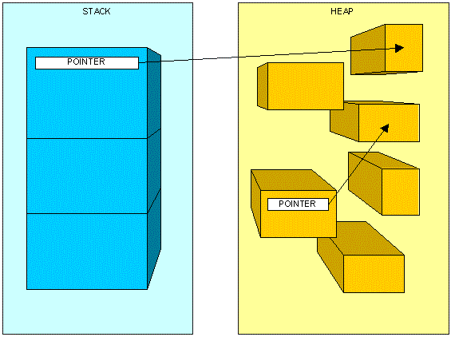

# Disposing and Managing Resources 🍣

## Managing resources🔹

When we are building applications with the C# language, the chances are that we are also doing that in tight collaboration with the .NET framework. This is a unique and powerful combination of syntax, features, libraries, and systems that cooperate in the background to serve and manage our application. One of the things that the .NET Framework does for us, manage its own resources. This means that when we use the classes, methods, and systems from the .NET Framework, it works in the background to track what is used and removes instances that we are not going to use. These resources that are in the scope of the .NET Framework and that are managed automatically are called managed resources. But we don't always work exclusively with the .NET Framework and its features. Sometimes we need some external resources. This can be a connection to the file system, to a database, to some other server or API, services, etc. These resources are outside of the .NET Framework scope and are not managed automatically. that is why we need to manage them ourselves. These are called unmanaged resources.

## Introduction to memory usage

When we are programming and writing code, that code has to be stored somewhere in the memory. This means that it has to take up space somewhere. Since there are different types of entities with different complexity and structure, the code that we write is divided into the Heap and Stack.

### Stack

The stack is the memory where we can allocate things that are static. Since the things we store here are static, they are saved directly, and retrieving stored data is very fast. In the stack, we can keep value types such as variables with integers, strings, booleans, etc. The stack also houses all the references to complex types such as instances of classes. This does not mean that it holds the whole instance and the data of the class, it just means that it remembers the address of where the class instance is stored so it can point to it when somebody requests to use it. The stack also tracks the order of the memory allocated ( Last In First Out ) so all the things that enter the stack are used in the reverse order in which they were added.


### Heap

The heap is the dynamic part of the memory, where we keep the complex types of data such as class instances themselves. This memory is allocated at runtime, meaning that it is a bit slower. Unlike the stack, the heap has no particular order and we can access and use any entity in the heap at any time. With that said, allocating memory here can be done at any time and that memory can be cleared at any time. As we said, we store the instances of classes ( objects ) in the heap. When a new instance is created, the memory is allocated in the heap and the data for that object is stored. In the stack, an address pointing to that memory location is saved. When we call that address it points to the object in the heap and we can access it, change it. Luckily we don't have to constantly worry about the heap since the .NET Framework manages most of the heap automatically.



### A C# Object life cycle


## Disposable🔹

We mentioned that throughout our development process we can encounter some resources that are not managed automatically. Those unmanaged resources need to be managed manually. The process of releasing those resources that we allocated is called disposing or disposable. Unmanaged resources can lead to slow application, running out of available resources, and even blocking our application. The classes that support this system of disposing of always inherit from the IDisposable interface. In the .NET Framework, classes that work with an outside source are always classes that can be disposed of.

### Disposing manually

Let's say that we want to create a connection to some file and work with it. When we are done we need to close the connection. But there are a few issues with this code. The first and most obvious is that we have to remember to write the Dispose() method. If we don't this connection will hang as long as our application is running. Another thing is that we can exit our method before the Dispose() is even called. This can happen if we return something in a scenario before we get to Dispose() or simply have an exception at some point before we get to the Dispose() method. These scenarios need to be taken into consideration when we use this approach in handling unmanaged resources.

#### Manual disposing

```csharp
public void AppendTextInFile(string text, string path)
{
  StreamWriter sw = new StreamWriter(path, true);
  // If something were to happen here, the class will not get disposed along with this connection to the file system
  if (text == "break") throw new Exception("Something broke unexpectedly...");
  sw.WriteLine(text);
  sw.Dispose(); // We dispose here manually
}
```

### Disposing of with Using Block

There is a feature in C# that allows us to automatically call a Dispose() method when a code block finishes with execution. No matter what happens in our code block, when it is done, the Dispose() method will be called. This is done with the Using block. We can write a using block and inside create an instance of a disposable class. The instance of that class is only available in that block of code and only when the block is done under any circumstance, the Dispose() will get called automatically. This helps us in multiple ways. We are sure that we will dispose of the class properly and we also scope the instance of the disposable class in the context where we want to use it.

#### Disposing with the Using Block

```csharp
public void AppendTextInFileSafe(string text, string path)
{
  using (StreamWriter sw = new StreamWriter(path, true))
 {
    if (text == "break") throw new Exception("Something broke unexpectedly...");
    sw.WriteLine(text);
  } // After this block the class will dispose it self no matter what happens
}
```

## Building a disposable class 🔹

The disposable classes from the .NET Framework aside, we can also use the IDisposable interface to build our own disposable classes with our own implementation for the Dispose() method. In the Dispose() method we can implement closing connections, resetting values, and all things necessary.

### Custom disposable class

```csharp
public class OurWriter : IDisposable
{
    private string path;
    private StreamWriter _sw;
    private bool disposedValue = false;

    public OurWriter(string filePath)
    {
           path = filePath;
           _sw = new StreamWriter(path, true);
    }
    public void Write(string text)
    {
        if (text == "break") throw new Exception("Something broke unexpectedly...");
        _sw.WriteLine(text);
    }

    // We implement this private method that will remember when this class is disposed
    // That way, if the same class tries to get disposed again, all the Dispose() methods will not get called
    private void _dispose(bool disposing)
    {
        // This happens only when the class needs to be disposed of the first time
        if (!disposedValue)
        {
            if (disposing)
            {
                _sw.Dispose();
            }

            path = "";
            disposedValue = true;
        }
    }
    // We can implement this method alone and add the disposing here
    public void Dispose()
    {
        _dispose(true);
    }
}
```

## Nullable values 🔹

In C# all values must have a type, which is something that we already established. The types can be value and reference types. Value types are usually primitive types such as integer or boolean. Reference types point to some complex entity such as an object. When objects are empty they hold the value of null, meaning that there is nothing there. That is the default value of any object. But value types hold a default value from their context, meaning that their default value resembles a normal value that can be interpreted as an intentional one. For instance, an integer has a default value of 0. This means that if we have a scoring system and somehow, a student gets an error and their score is not updated, the default value will stay 0 and that could be interpreted that the student had an error OR that the student didn't score any points. Because of this, in C# there is an option to make any value that does not accept null as a value to nullable. Nullable means that the type will accept values from its context as well as null. This can make logic much more precise and developers can implement code with fewer assumptions and special cases. Nullable is noted as a question mark after the type.

> Note: Among the primitive values, a string is nullable by design, and the? a notation will not work on it

```csharp
public class Person
{
    public int Id { get; set; }
    public int? Score { get; set; }
    public string Name { get; set; }
}

// Since we didn't add any value to this person, all values will be nullable
Person prs = new Person();
Console.WriteLine(prs.Id); // Is 0 by default
Console.WriteLine(prs.Score); // Empty result in the console
Console.WriteLine(prs.Score == null); // Is null by default
Console.WriteLine(prs.Name); // Empty result in the console
Console.WriteLine(prs.Name == null); // Is null by default

// prs.Id = null; // Throws an error. We can't put null in an int
prs.Score = null; // If it's nullable we can add null as a value
```

## Extra Materials 📘

* [Stack and Heap in .NET in depth](https://www.c-sharpcorner.com/article/C-Sharp-heaping-vs-stacking-in-net-part-i/)
* [All About IDisposable](https://gunnarpeipman.com/csharp-idisposable/)
* [Microsoft - Cleaning unmanaged resources](https://docs.microsoft.com/en-us/dotnet/standard/garbage-collection/unmanaged)
* [Implementing Disposable Classes in depth](https://www.codeproject.com/Articles/15360/Implementing-IDisposable-and-the-Dispose-Pattern-P)
* [Microsoft - Named and Optional arguments](https://docs.microsoft.com/en-us/dotnet/csharp/programming-guide/classes-and-structs/named-and-optional-arguments)
